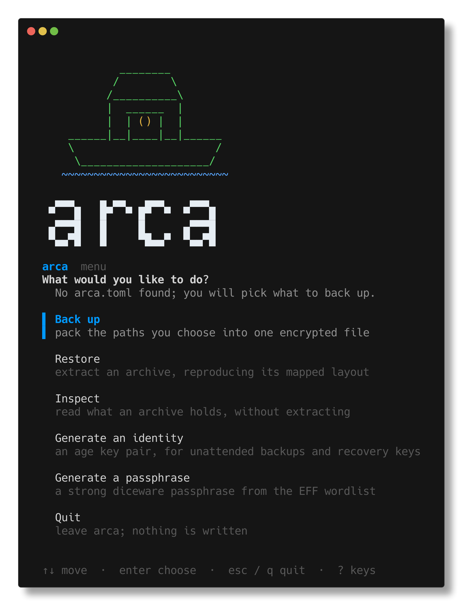

<p align="center">
  <picture>
    <source media="(prefers-color-scheme: dark)" srcset="docs/assets/arca-logo-dark.svg">
    <source media="(prefers-color-scheme: light)" srcset="docs/assets/arca-logo-light.svg">
    
  </picture>
</p>

<p align="center">
  Single-file encrypted backups for Unix-like systems. One binary, no runtime
  dependencies.
</p>

<p align="center">
  <a href="https://github.com/henriquemenezes/arca/actions/workflows/ci.yml"></a>
  <a href="LICENSE"></a>
  
  
</p>

```
arca backup --source ~/.ssh:dotfiles --source ~/.aws:dotfiles -o ~/backups/
```

produces one file — `arca-<host>-<timestamp>.tar.zst.age` — and nothing else.
No sidecar, no index, no repository.

Or you can just run `arca` and answer what it asks:

<p align="center">
  
</p>

> **arca is pre-1.0 and has not been independently audited.** It is provided as
> is, with no warranty of any kind. Verify every backup you care about
> (`arca verify`), keep more than one copy, and read the
> [disclaimer](#disclaimer) before trusting it with data you cannot lose.

## Install

**From a release** — download the archive for your platform from the
[releases page](https://github.com/henriquemenezes/arca/releases), check it
against `SHA256SUMS`, and put the binary on your `PATH`:

```bash
sha256sum -c SHA256SUMS --ignore-missing
tar -xzf arca_<version>_<os>_<arch>.tar.gz
install -m 0755 arca ~/.local/bin/arca
```

**With Go** (1.26.2 or newer):

```bash
go install github.com/henriquemenezes/arca/cmd/arca@latest
```

**From source:**

```bash
git clone https://github.com/henriquemenezes/arca
cd arca
make build      # ./arca, static, cgo-free
```

Releases are built for Linux and macOS, amd64 and arm64; other Unix-likes
(FreeBSD, illumos) compile but are not tested. There is no Windows build: the
archive carries uid/gid and permission bits, and putting them back (ownership
with `--preserve-owner`) is most of what the tool is for.

## Why not restic, borg or kopia

Those are repository engines built for frequent incremental backups of data that
barely changes. They deduplicate, they store absolute paths, and they restore to
the origin. If that is your situation, use one of them — they are excellent.

arca is for the other case:

- **Occasional full backups.** Before reinstalling the OS, when migrating
  machines, once a month. Deduplication never gets exercised, so you would pay
  its complexity — repository, pruning, retention policy, `check` — for nothing.
- **Any destination.** A restic repository inside a Dropbox or OneDrive folder is
  thousands of small blobs, and reconciling those is one of the most common ways
  to corrupt one. A single file is one upload.
- **Path remapping.** `~/.ssh` and `~/.aws` should come back under `dotfiles/`,
  not at their original absolute paths. No repository engine does this.
- **Metadata secrecy.** File names, directory structure and the mapping itself
  are inside the encryption. The artifact is one opaque file.
- **Restoring on a machine with nothing installed.** This is the important one.

## No lock-in

The archive is plain `tar` + `zstd` + `age`. If arca has vanished, your backup
has not:

```
age -d archive.tar.zst.age | zstd -d | tar -xp -C /destination
```

Three tools every distribution packages. None of them is in a base install —
`age` least of all — but all three are one package manager away, and the
one-liner above wants GNU tar or bsdtar for its `-C`. This is a design
invariant, covered by a test that runs the real `age`, `zstd` and `tar`
binaries against a real archive on every CI run — against GNU tar on Linux and
bsdtar on macOS — if it ever stops passing, the project has lost its reason to
exist.

## The mapping

`dest` is a directory inside the archive; each source contributes its basename
under it.

```toml
[[group]]
name    = "dotfiles"
dest    = "dotfiles"
sources = ["~/.ssh", "~/.aws"]
```

gives you `dotfiles/.ssh` and `dotfiles/.aws`. The mapping is applied while
writing, so restoring is a plain extraction — even with stock `tar`.

Two sources whose basename collides (`~/.config/nvim` and `~/.local/share/nvim`)
are a hard error at plan time, never a silent overwrite. Resolve it with an alias:

```toml
sources = [
  { path = "~/.config/nvim",      as = "nvim-config" },
  { path = "~/.local/share/nvim", as = "nvim-data"   },
]
```

## Leaving things out

Each group takes `exclude` patterns, which follow gitignore's most useful
convention:

```toml
[[group]]
name    = "projects"
dest    = "Work"
sources = ["~/Work"]
exclude = ["node_modules", "*.iso", "**/target/debug", ".cache/**"]
```

- A pattern **without** a `/` matches a **basename at any depth**:
  `node_modules`, `*.iso`, `__pycache__`.
- A pattern **with** a `/` is matched against the path **relative to the source
  root**, and then against the absolute path: `**/target/debug`, `.cache/**`.

Globbing is [doublestar](https://github.com/bmatcuk/doublestar), so `*`, `?`,
`[a-z]`, `{a,b}` and `**` all work. `arca plan` prints what survives the
patterns before anything is written.

In the interactive interface, `X` opens the excludes panel for the selected
source and `A` offers ready-made pattern sets per language, so the usual
twenty or thirty do not have to be typed by hand.

## Three ways to drive it

The TUI, an `arca.toml` and the command-line flags are three front-ends over one
configuration and one execution path. Precedence:
**defaults < `arca.toml` < flags**.

```bash
arca                    # interactive, when run on a terminal with no arguments
arca init               # write a commented ~/.arca/arca.toml
arca init .             # …or one that belongs to this directory
arca plan               # what would be captured; writes nothing
arca backup -o ~/backups/
```

Ad-hoc, with no config file at all:

```bash
arca backup --source ~/.ssh:dotfiles --source ~/Downloads -o /media/usb/
```

### Commands

| Command | What it does |
|---|---|
| `arca` / `arca tui` | the interactive interface |
| `arca init [PATH]` | write a commented config (`--force` to replace one) |
| `arca gen-key` | create an age identity (`-o` for a path other than `~/.arca/identity.age`) |
| `arca gen-passphrase` | print a diceware passphrase (`-w` for a word count other than 6) |
| `arca plan` | resolve the config and walk the sources; writes nothing |
| `arca backup` | write the archive (`-o` file or directory, `--no-plan` to skip the counting pass) |
| `arca list ARCHIVE` | manifest and every member (`--short` for the manifest alone) |
| `arca verify ARCHIVE` | decrypt and authenticate the whole archive |
| `arca restore ARCHIVE --target DIR` | extract (`--dry-run`, `--overwrite`, `--group`, `--preserve-owner`) |

`plan` and `backup` also take `-c/--config`, `--source PATH[:DEST]`,
`--level fastest\|default\|better\|best`, `--threads N` (0 = one per CPU),
`--compressor`, `--cipher`, `-r/--recipient`, `--follow-symlinks` (off by
default) and `--one-filesystem` (**on** by default, so mount points under a
source are not descended into).

`list`, `verify` and `restore` take `-i/--identity` (repeatable) and
`--passphrase-file`. With neither, arca tries `~/.arca/identity.age` if it
exists and otherwise asks for the passphrase.

### Where arca keeps things

`~/.arca/` holds the config and the key, and is the same path on Linux and on
macOS — one directory to put back on a machine you have just reinstalled.

| | |
|---|---|
| `~/.arca/arca.toml` | written by `arca init`, found by every later command |
| `~/.arca/identity.age` | written by `arca gen-key`, mode 0600 |

Config lookup stops at the first hit: `./arca.toml`, then `~/.arca/arca.toml`.
A config next to you wins, so a directory can carry its own without affecting
anything else. `-c` points at any file directly.

`$ARCA_HOME` overrides `~/.arca` entirely. Those are the only locations arca
knows: no XDG directory is read or written, on any platform.

## Encryption

Primitives are age's, not invented here: X25519 + HKDF-SHA-256 for key
agreement, ChaCha20-Poly1305 in the STREAM construction for the payload, scrypt
for passphrases.

Two modes, and **age forbids combining them** — a passphrase recipient must be
the only recipient, or the archive would fall back to the strength of that
passphrase:

```bash
arca gen-passphrase                       # diceware, ~77 bits, from the EFF list
arca backup --generate-passphrase         # generate and use one, shown once

arca gen-key                              # an age identity
arca backup -r age1daily... -r age1recovery...
```

Use several recipients. One everyday key, one recovery key kept offline, is the
protection against locking yourself out.

Reading an archive back in key mode means pointing at the identity — your own,
or the recovery one on another machine:

```bash
arca verify  archive.tar.zst.age -i ~/.arca/identity.age
arca restore archive.tar.zst.age -i /media/usb/recovery.age --target ~/restored
```

A passphrase you invent is refused if it fails a strength check
(`--allow-weak-passphrase` overrides, loudly). Passphrases are never read from
the environment: that would expose them in `/proc/<pid>/environ` and to anyone
who can list processes. Use a terminal or `--passphrase-file` (mode 0600).

**There is no recovery path.** Lose the passphrase or every identity that can
open an archive, and the data in it is gone — that is what the encryption is
for. Store the key somewhere other than the archives it protects.

## What an attacker holding the file learns

This is what the format is designed to give away, and what it is designed to
keep. It is a description of the design, not a warranty, and not the result of
an independent audit.

| Observable | Leaks? |
|---|---|
| File and directory names | **No** |
| Directory structure | **No** |
| File contents | **No** |
| The manifest and the mapping | **No** |
| uid/gid, mtimes, permissions | **No** |
| Approximate total size | Yes — inherent without padding |
| Whether it uses a passphrase or keys | Yes — the age header says so |
| Number of recipients | Yes; the recipients themselves do not leak |
| Date and hostname | Only through the file name; `--output` overrides it |

There is no checksum beside the file, and none is needed: the STREAM
construction authenticates every 64 KiB chunk and marks the final one, so
tampering anywhere and truncation at the end both fail. `arca verify` decrypts
the whole archive, which is a stronger check than any hash stored next to it.

Compressing before encrypting leaks plaintext information through size only when
an attacker has an adaptive oracle — injecting chosen plaintext and watching the
result, as in CRIME/BREACH. A one-shot backup gives no such oracle, which is why
restic, borg and kopia all do the same.

## Restoring safely

`arca restore` writes nothing outside `--target`. It refuses member paths that
are absolute or climb out, refuses to write through a symlink (the classic tar
attack: plant `link -> /etc`, then write `link/passwd`), refuses hardlinks
pointing outside, and skips device nodes. Existing files are never replaced
without `--overwrite`.

Permissions are restored with an explicit `chmod`, immune to your umask — an ssh
key restored as 0644 is silently ignored by ssh, and that is the difference
between a restore that works and one that appears to.

## Extending it

Compression and encryption are registry entries identified by magic bytes, not
by file extension, which is why a renamed archive still restores and why you
only need the key, not the algorithm:

```
peek → "age-encryption.org/v1\n" → age → decrypt
     → peek → 28 B5 2F FD        → zstd → decompress → tar
```

Adding gpg, openssl, xz or lz4 means implementing `codec.Compressor` or
`codec.Cipher` and registering it. The pipeline does not change.

## Known limitations

- **Full backup every time.** By design; see the top of this file.
- **macOS xattrs and resource forks are not preserved.** Keeping them would
  require a non-standard format, which would break restoring with stock `tar` —
  a deliberate trade.
- **Maximum compression is roughly `zstd -11`, not `-19`.** The pure-Go zstd
  implementation is what keeps the binary cgo-free and cross-compilable to
  macOS.
- **Zeroing passphrase memory is best effort.** Go's garbage collector may have
  copied the bytes already, and nothing here keeps them out of swap.

## Development

Go 1.26.2 or newer; nothing else is required to build.

```
make help      # list every target
make build     # static binary
make test      # unit tests, with the race detector
make check     # everything CI runs: lint, govulncheck, tests
make cross     # prove it cross-compiles to linux and darwin, amd64 and arm64
```

`make check` includes the emergency-restore tests, which build an `age` binary
into `.tools/` and need `zstd` and `tar` on the `PATH`.

[CONTRIBUTING.md](CONTRIBUTING.md) covers the workflow and what a pull request
is expected to carry. To report a vulnerability, follow
[SECURITY.md](SECURITY.md) — please do not open a public issue for one.

## Disclaimer

arca is free software provided **"as is", without warranty of any kind**,
express or implied, as set out in the [MIT License](LICENSE). In particular:

- **No guarantee against data loss or corruption.** Neither the authors nor the
  contributors are liable for any damage, loss of data, loss of profit or other
  loss arising from using — or being unable to use — this software, however
  caused.
- **A backup you have never restored is not a backup.** Verifying archives
  (`arca verify`), testing an actual restore, and keeping enough copies are your
  responsibility. Keep 3 copies, on 2 kinds of media, 1 of them off-site.
- **Encryption is irreversible without the key.** Losing the passphrase or every
  identity that can open an archive destroys the data inside it permanently. No
  one, including the authors, can recover it.
- **Not audited.** The cryptography is age's and is used as documented, but arca
  itself has had no independent security review.
- **Cryptography and the law.** arca includes and uses encryption software.
  Import, export, possession and use of such software are restricted in some
  jurisdictions; checking the rules that apply to you is your responsibility.

## Credits

arca is glue around other people's good work: [age](https://filippo.io/age) for
encryption, [klauspost/compress](https://github.com/klauspost/compress) for
pure-Go zstd, [Charm](https://charm.sh) for bubbletea and lipgloss,
[cobra](https://github.com/spf13/cobra) for the command line,
[doublestar](https://github.com/bmatcuk/doublestar) for glob matching, and
[zxcvbn](https://github.com/trustelem/zxcvbn) for the strength check.
Passphrases are drawn from the Electronic Frontier Foundation's long wordlist
(CC BY 3.0 US) — see [NOTICE](NOTICE).

## License

MIT — see [LICENSE](LICENSE), and [NOTICE](NOTICE) for third-party attributions.
